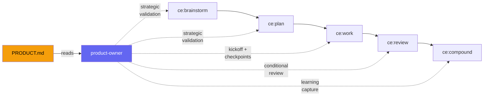

# Product Owner Agent

## Why This Exists

Engineering agents are excellent at execution — clean code, passing tests, good architecture. But execution without alignment produces well-built features that miss the mark. The most common failure mode in agentic workflows is not bad code; it's building the wrong thing well.

Human product managers solve this by sitting in the loop and steering. But when agents run autonomously — overnight, during a gym session, across a weekend — nothing enforces product alignment after you step away.

The product-owner agent fills this gap. It reads your project's PRODUCT.md (target users, strategic priorities, product principles, domain knowledge) and validates work against those requirements at every phase of the engineering lifecycle. Spending time up front on planning and goals pays off. It pays off even more when there's something in the workflow enforcing that alignment after you step away.

## How It Works

The product-owner agent is integrated across the compound engineering lifecycle. Every integration is conditional on PRODUCT.md existing in the project root — projects without one are unaffected.



| Phase | What product-owner does |
|-------|------------------------|
| **ce:brainstorm** (Phase 0.5) | Validates idea against strategic priorities before investing brainstorm time |
| **ce:plan** (Phase 0.45) | Validates feature alignment before research and planning |
| **ce:work** (Phase 1.5 + Phase 2) | Kickoff validation before implementation; decision and milestone checkpoints during execution |
| **ce:review** (conditional) | Full product requirements review alongside technical review agents |
| **ce:compound** (Phase 3.5) | Detects product learnings from completed work and proposes PRODUCT.md updates |
| **product-acceptance** (standalone) | On-demand product review for PRs, branches, or current changes |

## Relationship to product-lens-reviewer

The plugin includes a `product-lens-reviewer` agent in the `document-review` skill. These two agents are complementary, not duplicative:

| | product-owner | product-lens-reviewer |
|---|---|---|
| **Context source** | Reads **PRODUCT.md** — your stated strategy | Reasons **from the document itself** |
| **Core question** | "Does this align with what we decided?" | "Is the right thing being built?" |
| **Scope** | Entire lifecycle (5 skills + standalone) | Document review only |
| **Runs when** | PRODUCT.md exists | Document contains challengeable product claims |
| **Function** | Consistency enforcer | First-principles challenger |

The tension between them is valuable: product-lens might challenge a premise that PRODUCT.md explicitly endorses. That surfaces a question worth asking — is your stated strategy still right?

## Quick Setup

### 1. Create PRODUCT.md

Copy the template to your project root:

```bash
cp templates/PRODUCT.md ./PRODUCT.md
```

Fill in at minimum:
- **Target users** and core job-to-be-done
- **P0 priority** (non-negotiable requirement)
- **One product principle** (when to push back on YAGNI)

The agent works with partial PRODUCT.md — start small and evolve it as you learn.

### 2. Start Using the Workflows

Once PRODUCT.md exists, the product-owner activates automatically:

```bash
/ce:brainstorm "add social sharing"     # Product-owner validates strategic alignment
/ce:plan docs/brainstorms/sharing.md    # Product-owner validates before research
/ce:work docs/plans/sharing-plan.md     # Product-owner validates kickoff + checkpoints
/ce:review                              # Product-owner reviews alongside technical agents
/ce:compound                            # Product-owner captures product learnings
/product-acceptance 42                  # Standalone review of PR #42
```

## PRODUCT.md Structure

### Required Sections

```markdown
## Market Reality
**Target User:** [Who uses this? What's their role/context?]
**Core Job to Be Done:** [What problem are they solving?]
**Critical Success Factor:** [What makes or breaks the product?]

## Strategic Priorities (Ranked)
### P0: [Non-Negotiable]
**Why:** [Why this is absolutely required]
**Done when:** [Clear completion criteria]

### P1-P3: [Ranked by importance]
...

## Product Principles
### 1. [Principle Name]
[What you prioritize and why]
**When to push back on YAGNI:**
- [Scenario where completeness matters]
```

### Recommended Sections

```markdown
## Domain Knowledge
### [Key Concept]
[Explanation of domain concepts that inform decisions]
**Why this matters:** [How it affects requirements]

## Common Trade-offs
[When to prioritize X over Y]
```

## How Product Knowledge Compounds

The product-owner creates a feedback loop through `ce:compound`:

```
Work reveals product insight
  → ce:compound detects it (Phase 3.5)
  → Proposes PRODUCT.md update with evidence
  → You approve
  → Next review cycle, product-owner uses the updated context
```

Technical knowledge compounds through `docs/solutions/`. Product knowledge compounds through PRODUCT.md. Both make subsequent work easier.

## Reusable Across Projects

```
project-a/
├── PRODUCT.md    ← E-commerce priorities
└── ...

project-b/
├── PRODUCT.md    ← Compliance priorities
└── ...
```

Same agent, different product context per project. The agent adapts its validation to each project's stated requirements.

## Best Practices

1. **Update as you learn** — When `ce:compound` suggests a PRODUCT.md update, review and approve it. Stale product context produces stale validation.
2. **Start with P0** — A PRODUCT.md with only a P0 priority and one principle is more useful than no PRODUCT.md at all.
3. **Use early** — Get product validation during brainstorming, not just code review. Catching misalignment before implementation is cheaper.
4. **Keep priorities ranked** — The agent uses P0-P3 ordering to evaluate trade-offs. Unranked priorities provide weaker guidance.

## See Also

- `templates/PRODUCT.md` — Starter template to copy into your project
- `agents/review/product-owner.md` — Agent definition and review framework
- `skills/product-acceptance/SKILL.md` — Standalone product acceptance skill
